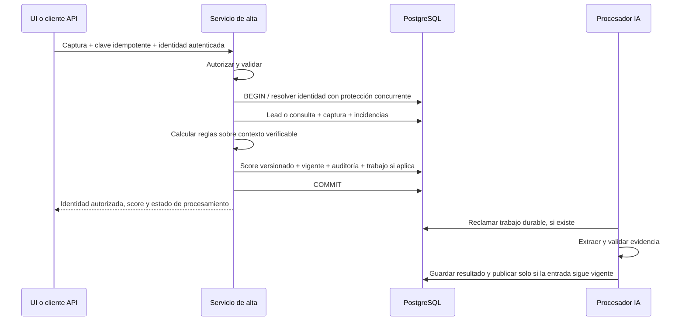

# Contratos funcionales y técnicos propuestos — versión 1

Estos contratos concretan el [plan maestro](PLAN_MAESTRO.md). Son propuestas
para ratificar en G0, no funcionalidades existentes ni acuerdos ya firmados por
agentes. Una modificación posterior necesita análisis de impacto, actualización
del contrato y pruebas afectadas antes de integrar código.

## C01. Identidad, empresa y permisos

### Identidad de aplicación

- Usuario Django propio, basado en `AbstractUser`, definido antes de la primera
  migración de autenticación. No reutilizar las tablas `auth` de Supabase.
- Membresía activa por usuario/empresa, rol y vínculo opcional a un asesor de
  esa misma empresa. Ser usuario activo no concede acceso a todas las empresas.
- Sesión de Django para HTML, con CSRF en escrituras; autenticación por token
  revocable de DRF para consumidores externos, exclusivamente mediante HTTPS.
- Propuesta inicial: `TokenAuthentication`, sin inventar tokens propios ni añadir
  JWT por anticipación. Emitir/revocar mediante un procedimiento restringido;
  no incluir tokens de demo en el repositorio ni habilitar registro público.
- Si existe una sola membresía, se puede seleccionar automáticamente. Si hay
  varias, la sesión exige elección explícita; la API recibe `X-Empresa-ID` y
  valida la membresía. Un selector ausente o inválido no selecciona otra al azar.
- `empresa_id` en el cuerpo de un alta no concede autorización: se rechaza si
  contradice el contexto y el servidor fija el valor definitivo.

El usuario propio debe configurarse al inicio para evitar una sustitución tardía
compleja. [Django: usuario personalizado](https://docs.djangoproject.com/en/5.2/topics/auth/customizing/#using-a-custom-user-model-when-starting-a-project).

### Matriz mínima

| Acción | Asesor | Supervisor | Operador técnico |
|---|---|---|---|
| Ver tablero | Cartera autorizada propia. | Empresa activa completa. | Sin acceso comercial por defecto. |
| Ver «mis leads» | Asignaciones propias. | Sus asignaciones si además es asesor; puede consultar colas de su empresa. | No. |
| Listar/ver lead | Asignado o creado por él pendiente de asignación. | Cualquier lead de su empresa. | No por el solo rol técnico. |
| Crear lead | Sí, en su empresa y sede autorizada. | Sí, en su empresa. | No por defecto. |
| Registrar gestión | Lead de su cartera autorizada. | Lead de su empresa, dejando actor real. | No. |
| Generar asignaciones | No. | Sí, sin superar reglas/capacidad. | Solo ejecución automática con permiso específico. |
| Revisar descartadas | No inicialmente. | Sí, conservando motivo e historia. | Diagnóstico técnico sin contenido comercial por defecto. |
| Ver estado de procesamiento | Estado de sus leads. | Estado de su empresa. | Estado técnico permitido, con datos mínimos. |
| Migrar/configurar infraestructura | No. | No. | Proceso administrativo separado de la web. |

La propiedad de una cartera debe persistirse; no puede depender solo de la última
asignación diaria. Crear un lead permite ver el resultado propio, pero no permite
usar la deduplicación para acceder a un cliente que ya pertenece a otro asesor:
si hay coincidencia fuera de su cartera, devolver un resultado restringido y
derivarlo al supervisor, sin contacto, conversaciones ni score del tercero.

### Aplicación del aislamiento

1. Resolver usuario, membresía y empresa antes de consultar datos comerciales.
2. Filtrar el conjunto de lectura antes de paginar, contar, buscar o agregar.
3. Buscar objetos hijos a través de un padre autorizado; verificar empresa y
   lead en consulta, conversación, extracción, prioridad y gestión.
4. Validar sede, asesor, filtros y relaciones también en las escrituras.
5. Incluir ámbito autorizado en claves de caché. Nunca reutilizar un agregado
   de supervisor para un asesor ni una respuesta de una empresa para otra.
6. Usar rol SQL web sin propiedad de tablas ni `BYPASSRLS`. Contexto SQL local a
   la transacción, derivado de autorización válida; ausencia de contexto falla
   cerrada. Probar reutilización de conexiones y pooling sin contexto residual.
7. Cubrir vistas y tablas hijas con permisos efectivos; no asumir que RLS en una
   tabla protege automáticamente una vista ejecutada con privilegios del dueño.
8. No dar acceso comercial mediante Django admin hasta verificar el mismo
   aislamiento; el admin no será un atajo de la demo.

Un ID ajeno se trata como no encontrado. Una acción no permitida sobre un objeto
visible devuelve 403. El contrato de token debe responder 401 al faltar o fallar
la autenticación; las rutas con sesión pueden responder 403 según DRF. Probar y
documentar ambas, sin confundir error de autenticación con acceso a otra empresa.

Los permisos por objeto no filtran automáticamente listados ni resuelven todos
los casos de creación. [DRF: límites de permisos por objeto](https://www.django-rest-framework.org/api-guide/permissions/#limitations-of-object-level-permissions).

## C02. Datos y captura de un lead

### Campos de la primera versión

| Campo | Contrato | Tratamiento |
|---|---|---|
| `nombre_cliente` | Texto obligatorio, sin quedar vacío al normalizar; máximo 200 caracteres. | Conservar original y normalizado. |
| `telefono` | Texto opcional si hay correo válido. | Regla compartida de país/formato; no completar prefijos sin respaldo. |
| `correo` | Opcional si hay teléfono utilizable. | Validar estructura; no asumir verificación de propiedad. |
| `sede_id` | Obligatoria y autorizada en la empresa activa. | Nunca confiar solo en el ID del formulario. |
| `ciudad` | Texto opcional. | Normalizar con reglas actuales; preservar desconocidos. |
| `canal` | Catálogo de canales reconocidos, o nulo. | No confundir canal comercial con origen técnico `plataforma`. |
| `modelos_interes` | Lista, posiblemente vacía, de texto original y SKU opcional. | Conservar todos; SKU solo si la correspondencia es verificable. |
| `presupuesto` | Decimal no negativo o nulo. | No usarlo como cuota inicial. |
| `cuota_inicial` | Decimal no negativo o nulo. | Cero explícito se conserva como cero. |
| `moneda` | Obligatoria si hay importe; en la demo se admite COP. | Etiquetar COP en el formulario, no inferir moneda de una conversación. |
| `forma_pago` | `credito`, `contado`, `mixto` o nulo. | No completar por ocupación, capacidad aparente u oferta del asesor. |
| `cliente_pidio_credito` | `true`, `false` o `null`. | No equivale a crédito aprobado. |
| `asesor_ofrecio_credito` | `true`, `false` o `null`. | Se mantiene independiente de la declaración del cliente. |
| `cliente_pidio_cita` | `true`, `false` o `null`. | No crea una cita confirmada ni una fecha inventada. |
| `cliente_pidio_cotizacion` | `true`, `false` o `null`. | No equivale a haber enviado la cotización. |
| `intencion_declarada` | Texto opcional, máximo 1.000 caracteres. | Declaración capturada, no intención inferida. |
| `objecion_principal` | Texto opcional, máximo 1.000 caracteres. | Ausencia no significa que no tenga objeciones. |
| `nota` | Texto opcional, máximo 2.000 caracteres. | Escapar al presentar; no interpretar como HTML. |
| `conversacion` | Opcional, mensajes con emisor y contenido según contrato de extracción. | Solo cuando existe una conversación real vinculable. |

Límites iniciales a ratificar: hasta 20 menciones de modelos, cada una de 200
caracteres; hasta 100 mensajes y 50.000 caracteres totales por conversación del
alta. Rechazar exceso con error explícito, sin truncamiento silencioso. El lote
conserva su contrato específico de fuentes; no aplicar estos límites de formulario
retrospectivamente a los originales.

Debe haber al menos un contacto utilizable: teléfono o correo. Si el teléfono
es inválido pero hay correo válido, conservar el teléfono original con incidencia;
si no hay ninguno, rechazar el alta interactiva con errores de campo. Esto no
cambia la política de conservación histórica de la ingesta.

El servidor fija empresa, actor, fecha real de captura y origen técnico. Los
campos estructurados son una **captura manual atribuida al usuario**, no una
extracción Gemini ni una cita textual inventada. La UI debe decirlo claramente.

### Fechas y contradicciones

- API: fechas `YYYY-MM-DD`; instantes RFC 3339 con zona. DB: instantes en UTC;
  presentación y día de trabajo en `America/Bogota`.
- No convertir fechas históricas de precisión diaria en horas observadas.
- Mantener la regla ya aprobada de inversión día/mes por el mismo lead y su
  coherencia registro/contacto; no reinterpretar globalmente otras personas.
- Una entrada estructuralmente inválida devuelve error de campo antes del commit.
- Un conflicto explícito entre declaraciones no se resuelve sumando señales:
  devolver los campos en conflicto para corregir el formulario. Si el conflicto
  viene de una conversación real, conservarla descartada con el motivo y excluir
  su extracción del score, según la política ya aprobada.
- Texto desconocido útil se conserva; no equiparar «modelo fuera del catálogo»
  con dato inválido. No eliminar un lead porque una conversación esté descartada.

## C03. Identidad canónica, duplicados e idempotencia

### Resolución de identidad

1. Validar y normalizar usando las mismas funciones que el lote.
2. Buscar solo dentro de la empresa activa. Una coincidencia en otra empresa
   no se fusiona, no se devuelve ni se anuncia al usuario.
3. Consultar mapeos de origen existentes y usar teléfono válido con nombres
   compatibles según la regla actual; no agregar coincidencia aproximada o por
   correo como nueva regla de fusión sin una decisión versionada.
4. Si la coincidencia es inequívoca y visible para el actor: crear una consulta
   nueva vinculada a la identidad existente; conservar sus otras consultas.
5. Si hay homónimos, teléfono compartido o candidatos incompatibles: responder
   `409 identidad_ambigua`, sin fusionar. La revisión de supervisor se registra
   fuera de las tablas comerciales definitivas hasta resolver el vínculo.
6. Coincidencia inequívoca fuera de la cartera del asesor: no crear duplicado
   para evadir permisos; registrar una solicitud restringida de revisión y
   devolver `202 revision_requerida`, sin ID de cliente ni datos existentes.
   El supervisor podrá aplicar esa captura al lead correcto mediante una acción
   auditada. Esta excepción debe ser visible como pendiente, no como alta exitosa.
7. Si no hay coincidencia: generar identidad estable, con espacio de IDs que no
   colisione con archivos, y registrar su procedencia. No recalcular ese ID cada
   vez que cambie el nombre o llegue otro canal.

No imponer teléfono único global ni asumir que todo teléfono compartido debe
fusionarse. Serializar la resolución de una misma clave empresa/teléfono cuando
exista, además de las restricciones de origen. Probar dos altas simultáneas.
El correo válido permite contactar, pero por sí solo no prueba identidad ni
garantiza evitar duplicados; registrar ese límite para revisión.

### Reintentos

- `Idempotency-Key` obligatorio en POST de alta. La UI genera una clave por
  intención de envío y la conserva al reintentar por timeout o doble clic.
- Vincular clave a empresa, actor y operación; guardar hash del cuerpo canónico,
  estado y resultado. No guardar un secreto de autenticación como clave.
- Misma clave y mismo cuerpo: devolver el mismo resultado, sin nueva consulta,
  score ni trabajo IA. Revalidar permiso actual antes de devolver datos guardados.
- Misma clave con distinto cuerpo: 409, sin modificaciones.
- Operación concurrente con la misma clave: esperar de forma acotada o devolver
  conflicto temporal documentado; nunca ejecutar dos veces la operación lógica.
- Retención inicial: conservar las claves durante la vida de la demo. Una
  futura caducidad debe documentar qué reintentos dejan de estar protegidos.
- Otros POST que crean gestiones/trabajos también necesitan protección equivalente.

### Transacción de alta



El commit debe incluir la persistencia del trabajo pendiente si hay conversación.
Una señal en memoria o `on_commit` que llama a un proceso sin cola durable no
garantiza recuperación tras reinicio. No llamar Gemini dentro de la transacción.
Si falla la persistencia, no devolver un lead o score como guardado.

## C04. Score, temperatura y contexto

Se mantiene `reglas_evidencia_v1` como política operativa. La transformación a
servicio puro debe conservar resultados sobre la misma instantánea de entrada.

| Señal explícita utilizable | Puntos sobre 90 |
|---|---:|
| Modelo identificado sin ambigüedad | 10 |
| Cuota inicial positiva declarada | 30 |
| Pago declarado `credito` o `contado` | 10 |
| Cliente solicitó cita | 40 |

`score_prioridad = redondear(puntos / 90 × 100, 2)`.

- No sumar por presupuesto, por crédito ofrecido, por cotización solicitada o
  por existir una nota: no son contribuciones de la versión aprobada.
- Pago `mixto` se conserva, pero no recibe automáticamente los 10 puntos de v1.
- Con varios modelos sin uno seleccionado verificablemente, conservar todos y
  mantener la señal como ambigua. Un texto no mapeado no recibe SKU ficticio.
- Cero inicial no suma; desconocido tampoco, pero deben conservarse distintos.
- **Temperatura no usa umbrales numéricos:** cita explícita → `caliente`; sin
  cita, inicial positiva o pago crédito/contado → `tibio`; en otro caso →
  `sin_informacion_suficiente`. No inventar una categoría «frío = desinteresado».
- Cita sin otras señales: 44,44 y caliente. Modelo+inicial+pago: 55,56 y tibio.
  Todas las señales: 100 y caliente. Solo modelo: 11,11 e información insuficiente.
- La UI explica puntos, origen, contexto, versión y siguiente acción; nunca lo
  presenta como probabilidad de compra ni como predicción calibrada.

### Qué datos alimentan una prioridad

Usar una foto comercial coherente. El pipeline actual selecciona el último
contexto verificable y no acumula indiscriminadamente conversaciones de distintas
fechas. El alta manual incorpora una nueva clase de fuente, que debe pasar por
el mismo selector de contexto: captura atribuida o extracción validada.

Si no se puede ordenar el contexto por fecha/precisión, publicar el resultado
con señales afectadas desconocidas y cola de revisión. No usar el orden de
inserción ni sumar una inicial antigua con una cita de otro contexto para inflar
la prioridad. Captura actual tiene hora real; eso no completa las horas de una
fuente histórica. Resolver explícitamente empates e incompatibilidades.

Registrar revisión de entrada, fuentes elegidas/excluidas y motivo. Conservar
las colas actuales: revisión de descartado CRM, revisión de datos, primer
contacto/ampliar información y seguimiento comercial. Una operación comercial
posterior confirmada puede cambiar elegibilidad sin reescribir el CRM de origen.

### Modelo experimental

- Mantener regresión logística comercial sin pesos como artefacto experimental.
- Solo inferencia, con hash, versión y contrato de features verificados.
- Si el artefacto falta o es incompatible, score ML nulo y motivo. No impedir
  guardar una prioridad operativa correcta ni entrenar dentro del POST.
- No cambiar el ranking operativo por ML ni afirmar mejora sobre FIFO sin
  evaluación nueva válida. Julio ya explorado no es un nuevo test independiente.
- Separar `score_prioridad` de `score_modelo_experimental` en DB, API y pantalla.

## C05. Convivencia de altas y lotes

### Problemas concretos que hay que corregir

- `verificar_base_operativa`, en el cargador actual, exige que el snapshot
  contenga los registros operativos ya persistidos. Un alta web ausente de los
  archivos puede hacer que el siguiente lote falle por omisión.
- `v_prioridad_vigente` selecciona una ejecución global completada de
  clasificación importada. Una ejecución individual necesita vigencia por lead.

### Contrato nuevo

1. Registrar origen/partición/ID externo para cada entidad importada y su
   identidad canónica. Resolver por mapeos persistidos antes de crear IDs nuevos.
2. Comprobar integridad de snapshot dentro del ámbito de esa fuente. Conservar
   la detección de desapariciones reales; excluir del requisito de pertenencia
   los registros que solo existen por captura web u otra fuente independiente.
3. No desactivar toda la validación ni volcar las altas al CSV para disimular
   incompatibilidades. Archivos originales y capturas tienen procedencias distintas.
4. Proteger campos operativos —gestión, cartera, próxima acción— de la recarga de
   columnas históricas. Guardar nuevo original importado sin borrar historia web.
5. Establecer prioridad vigente por `(empresa_id, lead_consolidado_id)` mediante
   referencia explícita a una prioridad válida, completada y del mismo lead.
6. Inicializar referencias desde la última ejecución aceptada al migrar. Después,
   una actualización individual solo cambia su lead; los demás conservan vigencia.
7. Aumentar revisión de entrada ante cambios comerciales relevantes. Un proceso
   publica mediante comparación de revisión o bloqueo común. Resultado tardío
   puede conservarse como historia, pero nunca sustituir una entrada más reciente.
8. Lote y web comparten esta coordinación. Serializar solo lotes no evita que
   una escritura web ocurra mientras el lote calcula su snapshot.
9. Una ejecución fallida no se publica como completada; las prioridades vigentes
   previas siguen disponibles. Documentar frontera transaccional y recuperación.

**Prueba decisiva:** crear un lead web, añadir una consulta a uno existente,
registrar gestión y luego recargar los archivos originales dos veces. Deben
conservarse identidades, ambas procedencias, gestiones y prioridades correctas;
sin filas duplicadas ni ocultación de los leads del lote. Comparar campos e IDs,
no solamente totales.

## C06. «Mis leads de hoy», cartera y capacidad

### Significado del día

`hoy` es el día local actual de Bogotá. La pantalla muestra asignaciones de ese
día; no filtra únicamente fecha de creación. Los datos históricos conservan sus
fechas. Se puede asignar backlog todavía elegible y seguimientos pendientes.

### Elegibilidad

- Mismo ámbito de empresa y sede; asesor/membresía activos.
- Estado operativo abierto. Cerrado, perdido o descartado por gestión vigente
  quedan fuera. Si todavía no hay gestión operativa, todas las consultas CRM
  descartadas bloquean asignación automática hasta revisión.
- Colas de revisión de identidad/datos no entran en atención automática. El
  supervisor ve sus cantidades y motivos, sin convertirlas en leads fríos.
- Seguimiento con próxima acción futura no se asigna antes de vencer.
- Una solicitud antigua de cita no acredita cita pendiente hoy; sugerir confirmar
  su estado, sin generar una reserva en el calendario.

### Orden y reparto propuestos

1. Mantener las asignaciones ya creadas para ese día: refrescar la página no
   genera otras ni cambia de asesor a alguien gestionado.
2. Atender primero seguimientos vencidos/de hoy de la cartera correspondiente;
   dentro del grupo, vencimiento más antiguo y luego score descendente.
3. Después, backlog elegible por score descendente, antigüedad conocida ascendente
   y ID estable; antigüedad desconocida al final de los empates.
4. Asignar dentro de la sede al asesor elegible con más capacidad restante;
   desempatar por ID estable. Respetar dueño de cartera existente: no cambiarlo
   automáticamente por falta de cupo; enviar a pendientes para supervisor.
5. Capacidad diaria viene del catálogo/configuración validada. Cero, ausente o
   inválida implica no asignar automáticamente y mostrar motivo; no inventar 20
   contactos diarios ni asumir capacidad infinita.
6. Capacidad consumida = leads distintos asignados ese día, incluidos gestionados.
   Registrar gestión no libera cupo para crear una carga diaria ilimitada.
7. Conservar pendientes sin asignar con motivo: cupo, sede, asesor no disponible
   o revisión. El supervisor ve el remanente y puede corregir configuración.
8. Proteger unicidad empresa/día/lead y capacidad mediante transacción/bloqueo
   compartido. Dos disparos concurrentes no sobreasignan al mismo asesor.

El alta muestra el detalle inmediatamente. Si el creador es asesor elegible de
la sede y tiene cupo, puede recibir la asignación mediante el servicio común;
si no, mostrar «guardado, pendiente de asignación». No falsificar una asignación
solo para hacer aparecer el lead en «mis leads»; mantener acceso restringido a
sus capturas pendientes. La transferencia posterior de cartera es una operación
de supervisor auditada, no un efecto lateral de volver a ejecutar el ranking.

### Gestión comercial mínima

Resultados: `contactado`, `sin_respuesta`, `seguimiento_programado`, `cerrado`,
`perdido`, `descartado`. Las dos últimas requieren motivo; seguimiento requiere
fecha/hora futura válida. Cierre exige confirmación explícita, no score alto.
Registrar evento, actor real, instante y próxima acción; derivar estado vigente
en la misma transacción. No sobrescribir la historia de gestiones.

`sin_respuesta` acredita intento, no contacto efectivo. Una gestión no envía
WhatsApp, correo ni realiza llamada: únicamente registra la actividad declarada.
No incorporar envío automático de comunicaciones en esta versión.

## C07. Métricas del tablero

| Métrica | Población y definición |
|---|---|
| Leads activos | Identidades distintas visibles con estado operativo abierto. |
| Asignados hoy | Leads distintos con asignación del día local dentro del ámbito visible. |
| Gestionados hoy | Leads distintos con al menos una gestión comercial hoy; mostrar intentos/contactos por separado. |
| Pendientes de primer contacto | Activos sin evidencia de contacto efectivo; ausencia histórica se etiqueta como tal. |
| Seguimientos vencidos | Activos con próxima acción anterior al instante actual y aún pendiente. |
| Temperaturas | Una prioridad vigente por lead; «sin prioridad» separado de score cero. |
| SLA 24 horas | Registro y primer contacto con precisión horaria verificable; 24 horas corridas como hipótesis visible. |
| Descartadas/revisión | Conversaciones o leads según etiqueta; nunca mezclar denominadores. |

El período y los filtros deben aparecer en pantalla. Definir si cada filtro
opera sobre fecha de registro, asignación o gestión; no aplicar silenciosamente
«fecha de registro» a todas las tarjetas. Mostrar denominador en porcentajes;
con cero elegibles devolver nulo/no evaluable, no una tasa ficticia.

El SLA distingue: cumplido, vencido, todavía dentro del plazo y no evaluable.
Las fechas sin hora no participan como si hubieran ocurrido a las 00:00. Las
gestiones capturadas ahora no corrigen retrospectivamente el desempeño histórico.
Conversión histórica usa desenlaces conocidos, no convierte «sin gestión» en no
venta ni mezcla cohortes históricas con actividad de hoy sin indicarlo.

## C08. API v1

Los siguientes nombres son el contrato objetivo. A8 publica OpenAPI y ejemplos
de request/response; A3 revisa permisos de cada operación.

| Método y ruta | Resultado | Autorización |
|---|---|---|
| `GET /api/v1/me/` | Usuario y membresías propias, sin secretos. | Autenticado. |
| `GET /api/v1/dashboard/` | Indicadores y sus denominadores/filtros. | Cartera del asesor o empresa del supervisor. |
| `GET /api/v1/mis-leads/` | Asignaciones propias del día permitido. | Usuario vinculado a asesor. |
| `GET /api/v1/leads/` | Listado paginado y filtrado. | Conjunto autorizado. |
| `POST /api/v1/leads/` | Lead+consulta+prioridad, o revisión explícita. | Alta permitida e idempotencia. |
| `GET /api/v1/leads/{id}/` | Detalle autorizado con estado vigente. | Lectura del lead. |
| `GET /api/v1/leads/{id}/conversaciones/` | Conversaciones utilizables paginadas. | Lectura del lead; descartadas solo supervisor. |
| `GET /api/v1/leads/{id}/prioridades/` | Historia versionada de prioridades. | Lectura del lead. |
| `POST /api/v1/leads/{id}/gestiones/` | Evento comercial y estado resultante. | Gestión del lead e idempotencia. |
| `GET /api/v1/catalogo/modelos/` | Marcas/modelos, SKU y datos conocidos del catálogo. | Autenticado; sin datos de clientes. |
| `GET /api/v1/sedes/` | Sedes permitidas. | Empresa activa. |
| `GET /api/v1/asesores/` | Asesores visibles y capacidad autorizada. | Supervisor; asesor solo información propia necesaria. |
| `POST /api/v1/asignaciones/generar/` | Resumen idempotente de asignación diaria. | Supervisor o servicio específico. |
| `POST /api/v1/leads/{id}/responsable/` | Transferencia de cartera auditada a asesor válido. | Supervisor de la empresa; no sobreasignar cupos. |
| `GET /api/v1/revisiones/` | Capturas pendientes, motivos y estado. | Supervisor de la empresa; solicitante solo estado de sus capturas. |
| `POST /api/v1/revisiones/{id}/resolver/` | Vincular captura o rechazar con motivo, de forma idempotente. | Supervisor; misma validación de identidad, empresa y score. |
| `GET /api/schema/` y `/api/docs/` | Esquema y documentación interactiva. | Autenticado en esta versión. |

No habilitar CRUD genérico sobre todas las tablas. Cambiar un score directamente,
borrar historia o escoger una empresa arbitraria no son operaciones del producto.
Marcas/modelos se incluyen explícitamente: conservar catálogo existente y sus
relaciones; no repartir stock global entre sedes sin información de origen.

Resolver una revisión no permite forzar una unión incompatible: el supervisor
debe aportar una corrección verificable o rechazar con motivo. La captura original
se conserva y la aplicación del cambio pasa por el mismo servicio de alta. La
lectura del solicitante solo contiene estado/motivo no sensible; no serializar
candidatos, vínculos internos ni datos comerciales ajenos.

### Formato común

- JSON UTF-8; campos ausentes conocidos como desconocidos se representan con
  `null`, no con cadenas vacías, ceros o falsas negativas.
- Importes como cadenas decimales; score como número entre 0 y 100 con dos
  decimales de precisión de cálculo. IDs opacos tratados como texto.
- Paginación: 25 por defecto, máximo 100; `count`, `next`, `previous`, `results`.
- Filtros con lista permitida: fecha, sede, canal, asesor, temperatura, cola y
  estado, según endpoint. Orden permitido explícito; no ejecutar campos SQL
  recibidos del cliente. Una sede ajena no produce conteos de esa sede.
- Errores: `code`, `detail`, `errors` por campo y `request_id` sanitizado. No
  mostrar SQL, credenciales ni datos de un candidato fuera del ámbito autorizado.
- Alta nueva o consulta añadida: 201; reintento resuelto: 200 con los mismos IDs;
  captura restringida en revisión: 202; entrada inválida: 400; conflicto: 409;
  límite de tamaño: 413; cuota HTTP: 429, sin confundirla con cuota Gemini.

Ejemplo **sintético** de resultado de alta; los IDs y la versión de entrada son
ilustrativos. Los nombres definitivos se congelan con el esquema OpenAPI en G0.

```json
{
  "lead_consolidado_id": "WEB-ejemplo-001",
  "consulta_id": "WEB-consulta-ejemplo-001",
  "lead_creado": true,
  "revision_entrada": 1,
  "prioridad": {
    "score_prioridad": 55.56,
    "temperatura": "tibio",
    "metodo": "reglas_evidencia_v1",
    "puntos": 50,
    "maximo_puntos": 90,
    "contribuciones": [
      {"senal": "modelo_identificado", "puntos": 10},
      {"senal": "inicial_positiva", "puntos": 30},
      {"senal": "forma_pago_declarada", "puntos": 10}
    ],
    "score_modelo_experimental": null
  },
  "enriquecimiento": {"estado": "no_requerido"},
  "asignacion": {"estado": "pendiente", "motivo": "sin_cupo"},
  "incidencias": []
}
```

La autenticación por token de DRF usa `Authorization: Token <token>`; no llamar
Bearer a ese esquema. [DRF: TokenAuthentication](https://www.django-rest-framework.org/api-guide/authentication/#tokenauthentication).

## C09. Trabajos IA y ejecución alojada

- Trabajo lógico identificado por empresa, entidad, hash/revisión de entrada y
  versiones de prompt/esquema/modelo. Repetir el evento no consume cuota otra vez.
- Estados explícitos: pendiente, ejecutando, reintento, completado, fallido y
  obsoleto. Reclamo exclusivo con vencimiento; recuperar un proceso interrumpido.
- La duración del permiso de ejecución debe superar el timeout de la llamada,
  o renovarse mientras el proceso esté vivo. No permitir dos reclamantes activos.
- Reintentar errores transitorios con espera incremental, máximo de intentos y
  respeto de `Retry-After`. Credencial inválida o JSON semánticamente inválido
  requieren diagnóstico/política específica; no bucles infinitos.
- Preservar cuota gratuita/configurada, caché y modelo ya aprobado. No cambiar de
  modelo ni usar uno facturable automáticamente para resolver un 429.
- Validar citas, emisor, importes, fechas y contradicciones antes de usar señales.
- Publicar nuevo score solo si coincide la revisión actual de entrada. Si cambió,
  conservar diagnóstico y programar la versión pertinente sin sobrescribirla.
- Mantener fuentes, caché, modelos y manifiestos en almacenamiento durable privado;
  disco efímero solo como espacio temporal. No publicar originales como estáticos.
- Escoger al menos un disparador real alojado, por horario o evento; documentar
  frecuencia/latencia esperada, credenciales y responsable de verificarlo.
- El job se ejecuta con el computador del desarrollador apagado. Un worker web
  no lanza todo el pipeline como hilo local al recibir el POST.

## C10. Auditoría, seguridad y errores operativos

Registrar actor/proceso, empresa, entidad, operación, versiones, fecha, resultado
y correlación. Datos comerciales completos viven en tablas autorizadas y fuentes
privadas; los logs rutinarios usan IDs técnicos, conteos y códigos.

Fijar timeouts SQL/HTTP, cuerpo máximo, paginación y límites de acceso. En
producción: HTTPS, `DEBUG=False`, cookies seguras, hosts/CSRF explícitos y estáticos
comprobados. Health público mínimo sin datos; diagnóstico detallado restringido.
Separar proceso de migración y cuentas de aplicación/carga. Secretos solo en el
gestor del hosting o entorno excluido de Git.

La auditoría de descarte conserva motivo y vínculo; nunca «borrar para que no
falle el gráfico». Huérfanas permanecen fuera del modelo comercial, con reporte
de revisión privado. Revisar también respuestas cacheadas y documentación demo.

## C11. Casos de aceptación compartidos

| ID | Preparación/acción | Resultado exigido |
|---|---|---|
| AC01 | Mismo teléfono y nombre, empresas A/B. | Dos identidades; ninguna fuga al crear/buscar. |
| AC02 | Mismo cliente/empresa por otro canal, visible. | Misma identidad, consulta adicional, historia preservada. |
| AC03 | Dos altas simultáneas de la misma identidad. | Resolución serializada; sin identidades duplicadas. |
| AC04 | Repetir clave de alta; después cambiar su cuerpo. | Mismo resultado primero, 409 después. |
| AC05 | Teléfono compartido y nombres incompatibles. | Revisión; sin fusión automática. |
| AC06 | Cero inicial / nulo / positiva. | Tres estados conservados; solo positiva aporta 30. |
| AC07 | Cita explícita como única señal. | 44,44 y caliente; explicación correcta. |
| AC08 | Oferta de crédito del asesor, cliente sin declarar pago. | No afirmar crédito pedido/aprobado ni sumar pago. |
| AC09 | IA falla o está sin cuota. | Alta persistida con reglas; trabajo pendiente/fallido visible. |
| AC10 | Resultado IA llega después de otra captura. | No reemplaza prioridad de entrada más reciente. |
| AC11 | Alta web + gestión + recarga de lote dos veces. | Conserva datos y vigente por lead, sin duplicados. |
| AC12 | Usuario A prueba IDs/hijos/filtros/conteos de B. | Sin datos ni agregados B, también con rol SQL web. |
| AC13 | Dos asignadores simultáneos con capacidad limitada. | Sin doble asignación ni cupos excedidos. |
| AC14 | Dataset antiguo, fecha actual nueva. | Backlog elegible en hoy, originales intactos. |
| AC15 | Registro sin hora conocida. | SLA no evaluable; no inventar hora ni incumplimiento. |
| AC16 | Conversación descartada con vínculo / huérfana. | Primera conservada y excluida de scoring; segunda fuera de DB comercial. |
| AC17 | Reiniciar procesador tras reclamar un trabajo. | Recuperación acotada, sin perder ni duplicar resultado. |
| AC18 | Asesor intenta alta coincidente con cartera ajena. | Revisión restringida; no revela datos ni duplica cliente. |
| AC19 | Sesión cambia de A a B y reutiliza filtros/caché. | Respuestas solo de B y nueva autorización. |
| AC20 | Registrar sin respuesta y luego contacto efectivo. | Intento separado del primer contacto; historial y métricas coherentes. |

## C12. Ratificación y versionado

A1 valida semántica comercial; A2 integridad/migraciones; A3 permisos; A4
identidad/score; A6 recuperación; A8 API; A7 convierte AC01–AC20 en evidencias.
A0 registra decisiones y resuelve dependencias. No implementar una interpretación
alternativa en silencio: registrar contrato afectado, propuesta, compatibilidad,
pruebas y revisión, siguiendo [AGENTES.md](AGENTES.md).
