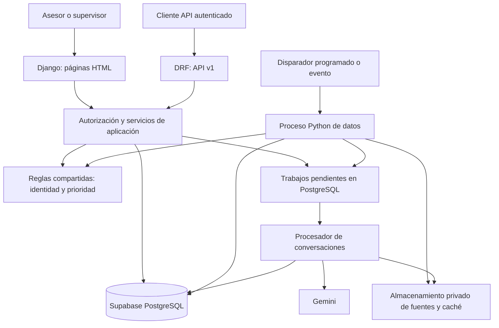

# Plan maestro de implementación

## 1. Objetivo y alcance autorizado

Construir una plataforma Django + Django REST Framework que convierta los datos
ya procesados en trabajo comercial diario, explicable y separado por empresa.
El usuario decidió implementar **las tres alternativas del enunciado** y añadir
el alta de leads:

1. Tablero de indicadores.
2. Vista personal de «mis leads de hoy».
3. API REST consumible y documentada.
4. Formulario y endpoint de alta: normalizar, resolver identidad, calcular score,
   persistir y mostrar el resultado.

La numeración del enunciado se conserva: automatización es el punto 6; publicación
de la plataforma/API es el 7; aislamiento por empresa es el 8. Este plan cubre
los tres y las adaptaciones necesarias en 1–5 para soportar entradas nuevas.

**Este documento conserva el plan y su avance.** La primera base local de
identidad ya se implementó en T03/T04; creación de usuarios reales, cambios de
esquema remoto, llamadas de IA y despliegue siguen pendientes de sus tareas.

## 2. Estado real al inicio

| Componente | Evidencia disponible | Trabajo pendiente |
|---|---|---|
| Ingestión y limpieza | Notebooks preservados y módulos Python; reglas revisadas. | Reutilización en altas individuales y entradas cambiantes. |
| Extracción IA | Gemini, contrato fijo, evidencias, caché y descartes. | Servicio por conversación y ejecución durable en nube. |
| Prioridad | Reglas explicables; regresión logística experimental sin pesos. | Calificación por lead, actualización versionada y lectura vigente mixta. |
| Persistencia | Supabase `crm`, 20 tablas de dominio, ledger y cuatro vistas. | Modelos de aplicación, datos operativos, permisos y migraciones nuevas. |
| Automatización | `run.py`, etapas, checkpoints, bloqueo local y modo watch. | Disparo alojado, almacenamiento durable y coordinación entre procesos/hosts. |
| Prueba remota del runner | Una ejecución completa conciliada en Supabase. | Segunda repetición remota del runner pendiente; no confundir con la del cargador original. |
| Django | 5.2.17, DRF 3.18.1, aplicaciones registradas y `check` correcto. | Conexión web PostgreSQL, usuarios, permisos, páginas, endpoints y despliegue. |
| Base web | Configuración provisional SQLite, sin migraciones aplicadas. | Definir usuario y migraciones antes del primer `migrate`. |
| Repositorio publicado | No se ha verificado aquí un remoto entregable ni su historial. | Auditar estado actual y publicar mediante acciones autorizadas. |
| Aplicación pública | No construida ni desplegada. | URL HTTPS, acceso de evaluación y prueba externa. |

Referencias del conjunto actual: 1.451 leads, 1.500 consultas, 665 conversaciones
en SQL, 446 utilizables y 219 descartadas; 12 conversaciones y 58 incidencias
relacionadas fuera de la DB. Son referencias de esta instantánea, no constantes
de producción. Se conservan los 2.200 históricos, incluidos los sin gestión.

## 3. Matriz de cumplimiento del enunciado

| Requisito | Entrega observable | Cierre verificable |
|---|---|---|
| 1. Ingestión sin intervención | Fuentes originales → ejecución automática. | Ejecutar desde entorno limpio sin editar datos. |
| 2. Normalización y consolidación | Originales, valores normalizados y auditoría. | Casos de teléfono, fecha, modelo, duplicado por canal y empresa. |
| 3. IA estructurada | Modelos, importes, pago, intención, objeción, cita y cotización. | Evidencias del emisor correcto; fallos registrados; ausencia preservada. |
| 4. Prioridad explicable | Score, temperatura, contribuciones y versión. | Mismas entradas y versión producen el mismo resultado por web/API/lote. |
| 5. DB como almacenamiento final | PostgreSQL relacional, restricciones y migraciones. | Lectura posterior, rollback, integridad e idempotencia. |
| 6. Automatización | Disparador alojado y trabajo durable. | Cambiar entrada autorizada o crear lead desencadena procesamiento sin pasos manuales. |
| 7. Publicación | Tablero + mis leads + API + alta en URL HTTPS. | Demostración desde un navegador ajeno al entorno local. |
| 8. Aislamiento | Identidad autenticada, ámbito de empresa y permisos SQL. | Pruebas negativas en listas, objetos, altas, agregados y rutas indirectas. |

El acceso público a la URL no implica que los datos deban ser anónimos: el
evaluador dispondrá de credenciales de demostración por un canal privado.

## 4. Principios que no se renegocian silenciosamente

- Misma persona en otra empresa conserva identidad separada.
- No completar datos ni declaraciones por intuición.
- Conservar modelos mencionados aunque no existan en catálogo.
- Fechas ISO y precisión de origen; no inventar medianoche.
- Un cero explícito es diferente de un dato ausente.
- Conversación descartada vinculada se conserva con motivo y flag.
- Conversación sin empresa/lead verificable permanece fuera de la DB comercial.
- Los históricos sin desenlace no se convierten en negativos de entrenamiento.
- La prioridad operativa sigue reglas; ML sigue experimental.
- Las modificaciones se versionan; no reescribir la evidencia de los notebooks.
- El flujo web no reentrena modelos ni ejecuta toda la ingesta al recibir un POST.
- No duplicar las reglas entre serializers, formularios y pipeline.

## 5. Arquitectura propuesta



### 5.1. Un servicio web, procesos de datos separados

- Django sirve páginas y DRF bajo el mismo dominio.
- Las páginas y endpoints llaman a los mismos servicios Python. No hace falta
  que una página Django se llame a sí misma por HTTP.
- El backend impone empresa, permisos, transacciones y contratos.
- Las reglas puras compartidas viven en un paquete Python importable; propuesta
  `dominio/`, con instalación explícita en los entornos web y de procesamiento.
- `auto-inicio-datos` conserva las entradas CLI y la orquestación. Los helpers
  estables se trasladan gradualmente a `dominio` con pruebas de paridad.
- `inicio-datos` permanece como evidencia histórica; no participa en runtime.
- Las tareas de IA se registran en SQL. Un proceso programado puede reclamarlas
  con bloqueo y lease; no se necesita introducir Redis/Celery para la primera entrega.

### 5.2. Organización orientativa

```text
dominio/                         Reglas compartidas sin dependencia de Django
plataforma/
  plataforma/                    Settings, URLs, WSGI/ASGI
  cuentas/                       Usuario, membresías, acceso y autenticación
  crm/
    models.py                    Mapeo de datos y extensiones operativas
    services/                    Casos de uso: alta, gestión, cola, score
    selectors/                   Consultas autorizadas y agregados
    api/                         Serializers, vistas, URLs y esquema API
    forms.py                     Validación de presentación
    views.py                     Páginas HTML
    templates/crm/               Tablero, lista, detalle, formulario
    static/crm/                  CSS/JS de la interfaz
    management/commands/         Bootstrap, asignación, jobs y demo
    migrations/                  Evoluciones coordinadas
    sql/                         SQL explícito usado por migraciones nuevas
auto-inicio-datos/               Lote y CLI, adaptados al dominio compartido
docs/plan-plataforma/            Este plan y sus contratos
tests/integracion/               Pruebas entre componentes y PostgreSQL
```

Crear directorios solo cuando tengan una responsabilidad concreta. No dividir
en múltiples apps o capas vacías para aparentar arquitectura.

## 6. Cambios de datos necesarios

El catálogo de 20 tablas no incluye todo lo necesario para usuarios, asignación,
gestión diaria, entrada manual y trabajos durables. Antes de crear tablas se
cerrará un diseño físico con A2 y A3. Propuesta de entidades lógicas:

| Entidad nueva | Campos/relaciones principales | Restricción clave |
|---|---|---|
| Usuario Django | Identidad de acceso, activo; basado en `AbstractUser`. | Definir `AUTH_USER_MODEL` antes de la primera migración. |
| Membresía | Usuario, empresa, rol, activo; asesor vinculado cuando corresponda. | Usuario/empresa único; asesor pertenece a esa empresa. |
| Captura estructurada | Consulta, empresa, declaraciones manuales, autor, fecha y origen. | No presentarla como extracción Gemini ni como cita de conversación. |
| Estado operativo y cartera del lead | Empresa, lead, asesor responsable, estado comercial, próxima acción, revisión de datos, prioridad vigente. | Una fila por empresa/lead; asesor de la misma empresa y FK de prioridad al mismo lead. |
| Asignación diaria | Empresa, fecha local, asesor, lead, posición inicial, estado y ejecución. | Empresa/fecha/lead único; capacidad protegida bajo concurrencia. |
| Gestión comercial | Empresa, lead, asesor/actor, resultado, nota y próxima acción. | Historial inmutable; referencias de la misma empresa. |
| Origen de registro | Tipo de fuente, ID externo, entidad canónica y huella. | Unicidad por ámbito de fuente; evita que lote y web reclamen la misma identidad. |
| Solicitud idempotente | Empresa, actor, operación, clave, hash del cuerpo, estado y resultado. | Misma clave/cuerpo devuelve el resultado anterior. |
| Captura pendiente de revisión | Empresa, actor, datos propuestos, motivo y estado de resolución. | Sin fusión automática ni acceso del solicitante a carteras ajenas; resolución auditada. |
| Trabajo de procesamiento | Entidad, empresa, versión de entrada, tipo, intentos, lease y estado. | Una tarea lógica por entrada/versión; reclamo exclusivo. |
| Evento de auditoría | Actor, empresa, acción, entidad, fecha, correlación y cambios permitidos. | No guardar secretos ni duplicar conversaciones completas en logs. |

Esto no obliga a crear una tabla nueva por concepto: estado, eventos o metadatos
pueden aprovechar entidades existentes si mantienen restricciones e historia.
La decisión física debe explicar qué se reutiliza y por qué.

### 6.1. Autoridad de las migraciones

1. Conservar `001_inicial.sql` y su hash. No volverla a generar.
2. Registrar tablas existentes mediante modelos no administrados cuando proceda.
3. Propuesta: Django será el único ejecutor de **las nuevas evoluciones** de la
   plataforma; SQL explícito versionado con `RunSQL`/estado ORM separado donde
   haga falta. El ledger original conserva su historia.
4. Documentar bootstrap: esquema original → migraciones Django ordenadas →
   permisos → datos de acceso/demo. El pipeline operativo valida compatibilidad
   y carga; no compite con Django por migrar tablas en cada ejecución.
5. Elegir un esquema privado para identidad/tablas de aplicación y fijar rutas
   de búsqueda de forma controlada. Nadie crea tablas en `auth` de Supabase.
6. Separar roles SQL de migración, carga y web. La web no utiliza el usuario
   propietario ni credenciales que omitan RLS.
7. Probar de cero y sobre una copia con los datos actuales. Revisar restricciones
   compuestas; no añadir IDs ficticios solo para satisfacer el ORM.

Django 5.2 tiene límites para relaciones y admin con claves primarias compuestas;
las consultas que lo necesiten usarán SQL parametrizado y adaptadores pequeños,
manteniendo la integridad real en PostgreSQL. [Referencia oficial](https://docs.djangoproject.com/en/5.2/topics/composite-primary-key/).

## 7. Alcance funcional de las pantallas

### 7.1. Acceso y navegación

- Login/logout de Django, cookies seguras en producción y CSRF activo.
- Empresa activa derivada de membresías; si hay más de una, selector limitado
  a las autorizadas. Cambiar empresa invalida selección/filtros previos.
- Navegación: tablero, mis leads, leads, nuevo lead y perfil.
- Rutas de revisión/operación solo para roles autorizados.
- Errores 403/404/500 comprensibles, sin trazas ni identificadores ajenos.

### 7.2. Tablero

- Tarjetas: leads activos, asignados hoy, gestionados hoy, pendientes de primer
  contacto y seguimientos vencidos.
- Distribución por temperatura y por cola, con número total y período visible.
- Filtros por fecha, sede, asesor y canal según permisos.
- Hora de última actualización y estado de datos de la empresa.
- No calcular tasas de conversión sobre «sin gestión» como negativos.
- No afirmar incumplimiento de 24 horas si falta precisión temporal; mostrar
  «no evaluable» y su denominador. Medir 24 horas corridas como hipótesis inicial,
  sin inventar horario comercial.
- Asesor: métricas de su cartera autorizada. Supervisor: métricas de su empresa.

### 7.3. Mis leads de hoy

- Día operativo en `America/Bogota`, independiente de la fecha del dataset.
- Asignaciones de hoy con orden explicable, pendientes, seguimiento y gestión.
- Tarjeta/fila: cliente, modelo, score, temperatura, motivo, acción, última
  interacción conocida y estado.
- Un clic al detalle; acción de registrar gestión y próxima acción.
- Indicador de capacidad diaria y pendientes sin asignar visibles al supervisor.
- No significa «leads creados hoy»: incluye backlog elegible y seguimientos
  vencidos. Regla exacta en [CONTRATOS.md](CONTRATOS.md).

### 7.4. Detalle

- Datos de contacto con originales/estado de calidad cuando sea útil.
- Consultas separadas por canal y fecha; no mezclar declaraciones incompatibles.
- Conversaciones ordenadas, emisor, texto escapado y precisión disponible.
- Extracción con evidencias enlazadas al mensaje; montos nulos como no informado.
- Prioridad vigente, contribuciones, versión y contexto utilizado.
- Modelo experimental en sección secundaria con sus limitaciones.
- Historial de asignaciones, gestiones y cambios de prioridad.
- Sección de descartadas restringida, con motivo; nunca reincorporarlas al score
  solo por mostrarlas en el detalle.

### 7.5. Nuevo lead

- Campos con ayuda, validación, mensajes de error y estados desconocidos explícitos.
- Empresa tomada de la sesión; sedes/asesores/modelos consultados dentro del ámbito.
- Vista previa de score opcional como mejora; el resultado del servidor es la
  autoridad y se calcula otra vez al confirmar.
- Alta transaccional con resultado visible: lead nuevo o consulta añadida a uno
  existente, ID, score, temperatura, explicación y estado de enriquecimiento.
- Reenvío o doble clic no duplica registros.
- Una contradicción no se oculta; las señales afectadas quedan desconocidas o en
  revisión según la política y se muestra el motivo.

## 8. Fases y puertas de calidad

Los IDs de tareas y responsables se desarrollan en [TABLERO.md](TABLERO.md).
Una puerta aprobada necesita evidencia; una conversación entre agentes no basta.

### F0 — Acuerdos y diagnóstico (T00–T02)

- Leer plan, código y contrato SQL; registrar discrepancias.
- Ratificar permisos, alta, score, asignación y origen de datos.
- Elegir propietario de cada archivo y protocolo de migraciones.
- Elegir proveedor de despliegue según presupuesto; no crear cuentas de pago
  ni prometer un plan gratuito no verificado.
- Crear mapa de datos sensibles y fixtures sintéticos de tres empresas.

**G0:** contratos v1 registrados, sin conflicto abierto de identidad/empresa,
propiedad de tablas o significado de alta y score. Todo sigue pendiente al
momento de entregar este plan.

### F1 — Base segura y persistencia web (T03–T05)

- Crear usuario, membresías y vínculo con asesores antes de migrar.
- Configurar PostgreSQL y credenciales separadas.
- Mapear tablas actuales y aplicar extensiones aditivas con respaldo verificable.
- Implementar contexto de empresa, permisos y RLS para rutas directas e indirectas.
- Preparar fixtures y pruebas PostgreSQL con el rol de la aplicación.

**G1:** una cuenta A no puede listar, contar, abrir ni modificar datos B; la web
lee datos reales A. Restauración/migración de prueba documentadas.

### F2 — Servicios compartidos y alta individual (T06–T09)

- Extraer reglas puras conservando paridad de fechas, duplicados y score.
- Implementar alta idempotente, auditoría y versión vigente por lead.
- Adaptar el lote para convivir con altas web; no ocultar sus omisiones.
- Preparar ML como inferencia sobre artefacto validado y tareas IA durables.

**G2:** alta → score → commit → detalle; doble POST y dos POST concurrentes
funcionan correctamente; repetir el lote conserva altas y gestiones web.

### F3 — API y consultas de producto (T10–T12)

- Publicar endpoints paginados, filtros validados y errores uniformes.
- Exponer documentación OpenAPI y ejemplos autenticados.
- Implementar consultas de tablero y asignación diaria determinista.
- Registrar gestiones; pendientes/contadores coinciden con los listados.

**G3:** contrato API probado; clientes externos pueden consultar y crear un lead
sin acceso transversal. Asignación respeta sede, empresa y capacidad.

### F4 — Interfaz completa (T13–T14)

- Montar layout, login, tablero, cola, detalle, formulario y revisión autorizada.
- Integrar directamente los servicios compartidos; no duplicar lógica en JS.
- Probar móvil/escritorio, teclado, campos inválidos, vacíos y estados de carga.

**G4:** recorrido de asesor y supervisor completo; API, pantalla y DB muestran
la misma prioridad. El usuario puede estudiar el porqué de cada decisión.

### F5 — Nube y automatización operativa (T15–T17)

- Publicar web y proceso de datos; subir fuentes/caché a almacenamiento privado.
- Registrar disparo real por evento o horario, secretos y límites de ejecución.
- Revisar logs, métricas, salud, recuperación y exclusión de procesos simultáneos.
- Ejecutar la segunda verificación remota pendiente con el código vigente.

**G5:** procesamiento demostrado con el equipo local apagado; URL externa útil,
recuperación tras fallo sin pérdida/duplicación y sin depender de archivos locales.

### F6 — Entrega y sustentación (T18–T20)

- Auditoría final de permisos, fuentes, claves y commits reales.
- README de instalación/ejecución/despliegue, arquitectura y esquema actualizados.
- Presentación de máximo ocho diapositivas y guion de 30 minutos.
- Ensayo con cuentas de empresas diferentes y alta en vivo.

**G6:** evidencias de los ocho requisitos, tres interfaces y alta; repositorio y
URL entregables, acceso del evaluador y demo funcional.

## 9. Despliegue: decisiones y trabajo específico

Propuesta a ratificar en G0: un servicio Django en Railway o Render; Supabase
PostgreSQL existente; almacenamiento privado de objetos; proceso programado
para lote y trabajos IA. No hace falta Next.js ni Supabase Auth: la identidad
de aplicación se centraliza en Django.

- Instalar solo dependencias necesarias para cada proceso; evitar cargar el
  entrenamiento completo al arrancar cada worker HTTP.
- Fijar Python y paquetes; imagen Linux/servidor WSGI compatible con el hosting.
- Variables privadas de DB web, DB migración, Gemini y clave Django en el gestor
  de secretos. La clave de carga no se comparte con el navegador.
- `DEBUG=False`, hosts explícitos, HTTPS, cookies seguras, CSRF y estáticos
  configurados para la plataforma. Probar detrás del proxy real.
- Endpoint de vida mínimo y readiness sin exponer SQL, tablas o datos personales.
- Migración de release separada del arranque de cada réplica web.
- Revisar pausa por inactividad, cuotas y memoria con documentación vigente en
  la fecha de despliegue; no depender de créditos promocionales para la defensa.
- Usar ejecución única `run.py` por disparo programado; `--watch` local no es
  un mecanismo universal para un bucket ni para instancias efímeras.
- Si se usa GitHub Actions: secretos, concurrencia, tiempo límite, reanudación y
  persistencia de caché externa; comprobar alcance del evento y retención.
- Primer objetivo de operación: una sola ejecución de datos a la vez. Bloqueo
  local no coordina dos servidores; lease en DB para el pipeline y trabajos.
- Una restauración de DB debe incluir la asociación con fuentes y artefactos
  versionados; no basta tener una copia del código.

No se considera terminado el punto 6 por escribir un workflow sin ejecutarlo.

Referencias oficiales consultadas para estas alternativas: [Django en Railway](https://docs.railway.com/guides/django),
[tipos de procesos en Railway](https://docs.railway.com/build-deploy) y
[cron jobs de Render](https://render.com/docs/cronjobs). Render documenta pausa
por inactividad y disco efímero en su [modalidad gratuita](https://render.com/docs/free);
la decisión de hosting debe considerar estas restricciones, sin asumir que todos
los componentes del sistema estarán cubiertos por una capa gratuita.

## 10. Estrategia de pruebas y evidencia

| Nivel | Casos indispensables | Evidencia |
|---|---|---|
| Unitario | Ausencia/cero, fechas, identidad por empresa, contribuciones del score. | Casos sintéticos y resultados. |
| Contrato | Campos, tipos, nulos, enums, filtros, códigos HTTP e idempotencia. | Esquema API + pruebas de request/response. |
| Integración SQL | FKs compuestas, transacciones, permisos, RLS y migraciones. | PostgreSQL real de prueba; rol web real. |
| Concurrencia | Alta simultánea, capacidad diaria, job doble y score tardío. | Una identidad/asignación efectiva y ninguna sobrescritura obsoleta. |
| Paridad | Mismas reglas por lote, formulario y API. | Comparaciones por IDs/campos, no solo conteos. |
| Aislamiento | Empresa A contra B en cada ruta y agregado. | Matriz negativa completada, incluidas vistas y cachés. |
| E2E | Login → alta → score → hoy → gestión → tablero/API. | Ejecución en URL real, capturas complementarias y resultados. |
| Recuperación | Cuota IA, conexión SQL caída, proceso terminado, reinicio. | Estado correcto, caché conservada y sin duplicados. |

Objetivos iniciales medibles para el conjunto de demo, sujetos a medición:

- GET paginado y tablero p95 menor a 2 s en servicio caliente.
- Alta sin llamada IA p95 menor a 3 s; IA nunca mantiene abierto ese POST.
- Ninguna consulta sin paginación en listados; presupuesto de consultas SQL
  documentado y sin crecimiento N+1 por fila.
- Cero fallos de aislamiento y cero duplicados por reintento en los casos críticos.

No son garantías de infraestructura todavía contratada. Si no se cumplen,
medir consultas/red y corregir antes de aumentar servicios por intuición.

## 11. Rúbrica y sustentación

| Bloque / peso | Evidencia a preparar |
|---|---|
| Negocio / 10 | Problema, definición de hoy, capacidad, hipótesis y decisiones. |
| Datos / 15 | Normalización, trazabilidad, esquema mixto e integridad. |
| Automatización / 15 | Evento/horario alojado, reintento real y ausencia de pasos manuales. |
| IA / 20 | Contrato, citas, desconocidos, evaluación histórica y límites del modelo. |
| Ingeniería / 12 | Servicios compartidos, tests, contratos, estilo y commits reales. |
| Despliegue / 10 | URL accesible, configuración reproducible y salud. |
| Producto / 6 | Tablero, cola, alta, detalle y API comprensibles. |
| Documentación / 5 | README, arquitectura, datos, API y decisiones. |
| Sustentación / 7 | Recorrido explicable de 30 minutos y manejo de preguntas. |

Guion propuesto: 10 min de demo, 10 de código/decisiones y 10 de preguntas,
conforme al enunciado. Presentación: 1 problema; 2 datos; 3 arquitectura;
4 IA/evidencias; 5 scoring/evaluación; 6 producto; 7 seguridad/automatización;
8 resultados, límites y siguientes pasos. No inventar mejoras de ventas.

## 12. Riesgos y mitigación

| Riesgo | Mitigación / responsable |
|---|---|
| Scope mayor al ejercicio de 10–12 horas estimadas | Entregar primero un recorrido completo de los cuatro productos; A0 prioriza. |
| Alta web desaparece al recargar | Orígenes explícitos y prioridad vigente por lead; A2+A4+A7. |
| Admin o SQL privilegiado omite aislamiento | Rol web limitado, pruebas directas y cierre de admin comercial; A3+A7. |
| Sin datos «de hoy» por fechas antiguas | Cola de backlog/asignaciones actuales; fechas originales intactas; A1+A4. |
| Score alto interpretado como probabilidad | Etiquetas y explicación consistentes; A1+A5. |
| Citas históricas tratadas como citas futuras | Mostrar declaración original y pedir confirmación comercial; A4+A5. |
| Fallos de cuota o proveedor IA | Score inmediato por hechos disponibles; job pendiente y reintento; A4+A6. |
| Pérdida de caché en nube | Objetos privados/DB y manifiestos versionados; A6. |
| Cambios simultáneos entre agentes | Propiedad de archivos, contratos versionados y cola de integración; A0. |
| Credenciales en commits/logs | Revisión de secretos y prueba de configuración; A3+A6. |
| Esquema con dos dueños de migración | Una autoridad para evoluciones nuevas y bootstrap probado; A2. |
| Permisos correctos en detalle pero no en conteos | Matriz de rutas indirectas y tests de agregados; A3+A7. |

El PDF fija cinco días desde su recepción y estima 10–12 horas para el ejercicio
original. No se conoce aquí la fecha de recepción ni se presume un nuevo plazo.
El alcance ampliado exige estimar después de G0. Usar tamaño relativo por tarea
y límites de trabajo en curso; evitar prometer un número de horas sin medición.

## 13. Definition of Done del proyecto

- [ ] Tablero, mis leads, API y alta funcionan con datos persistidos.
- [ ] Alta crea consulta/identidad correcta y score transaccional.
- [ ] Reintentos y ejecución concurrente no duplican entidades ni asignaciones.
- [ ] Lote y web conviven sin pérdida de altas, gestión o prioridad vigente.
- [ ] IA usa evidencia real y sus fallos no se presentan como éxito.
- [ ] No hay acceso a clientes de otra empresa por ningún canal probado.
- [ ] Automatización alojada ejecutada y recuperada tras un fallo controlado.
- [ ] URL HTTPS accesible y cuentas de evaluación habilitadas de forma privada.
- [ ] Dependencias, migraciones, repositorio e instrucciones reproducibles.
- [ ] Rúbrica cubierta con evidencia y presentación de hasta ocho diapositivas.
- [ ] Usuario puede explicar cada decisión importante y sus limitaciones.
