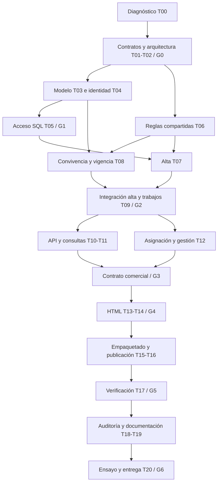

# Tablero detallado de implementación

**Ejecución iniciada el 2026-09-17.** T00 se completó con evidencia local; T01
se concretó en decisiones D-01 a D-05. Render fue elegido y su publicación
pospuesta por el usuario. El tablero no presenta tareas futuras
como terminadas. Ver [roles](AGENTES.md),
[contratos C01–C12](CONTRATOS.md) y [fases/puertas](PLAN_MAESTRO.md).

Tamaño relativo: S = un componente acotado; M = varios componentes relacionados;
L = integración transversal o concurrencia. No son horas prometidas. Después de
G0, A0 estima con los agentes según código y acceso disponibles, considerando el
plazo real restante. No rebajar criterios críticos para cumplir una estimación.

## 1. Vista general

| ID | Entrega | Responsable | Revisor | Dependencias | Tamaño | Estado |
|---|---|---|---|---|---|---|
| T00 | Diagnóstico, baseline y mapa de requisitos. | A0 | A7 | Ninguna. | S | Completada |
| T01 | Contratos y flujos ratificados. | A1, integra A0 | A2/A3/A4/A8 | T00 | M | Completada |
| T02 | Arquitectura, migraciones y decisión de hosting. | A0 | A2/A3/A6 | T00; coordinar T01 | M | En curso |
| T03 | Modelo físico y bootstrap web. | A2 | A3/A7 | G0 | L | En curso: migraciones locales |
| T04 | Identidad y autorización Django. | A3 | A2/A7 | G0; esquema de T03 acordado | M | En curso: modelo base |
| T05 | Roles SQL, RLS e integración de acceso. | A2 | A3/A7 | T03/T04 | L | En curso: RLS local |
| T06 | Reglas compartidas y score individual. | A4 | A2/A7 | G0 | M | En curso: prioridad e identidad compartidas |
| T07 | Alta transaccional e idempotente. | A4 | A2/A3/A7 | T05/T06; interfaz T08 | L | Alta SQL probada localmente; falta integración PostgreSQL |
| T08 | Convivencia web/lote y prioridad vigente. | A2 | A4/A6/A7 | T03/T06 | L | En curso: migración aditiva local |
| T09 | Procesamiento IA durable e inferencia. | A6 | A4/A2/A7 | T03/T06; revisiones T07/T08 | L | En curso: cola durable local |
| T10 | REST API y OpenAPI. | A8 | A3/A4/A7 | G1/T07; integrar T12 | M | API local y esquema básico; contrato completo pendiente |
| T11 | Consultas, indicadores y filtros. | A8 | A1/A3/A7 | T05/T08; contrato T12 | M | Selectores e indicadores locales; conciliación pendiente |
| T12 | Cartera, asignación diaria y gestión. | A4 | A1/A2/A7 | T05/T07/T08 | L | Gestión y asignador locales; transferencia/cupos pendiente |
| T13 | Layout, tablero, cola y detalle HTML. | A5 | A1/A3/A7 | G1; T10/T11/T12 para cierre | M | Implementado; aceptación visual pendiente |
| T14 | Alta y gestión desde formularios. | A5 | A4/A3/A7 | T07/T12/T13 | M | Implementado; integración PostgreSQL pendiente |
| T15 | Empaquetado, storage y configuración cloud. | A6 | A3/A2 | T02/T09; G4 para release | M | Docker/Render preparados; build y storage pendientes |
| T16 | Publicación y disparador real. | A6 | A0/A7 | T15/G4; autorización y acceso | L | Diferido por el usuario |
| T17 | E2E, concurrencia y recuperación. | A7 | A2/A3/A6 | G2/G3/G4; T16 para nube | L | Pruebas locales parciales; PostgreSQL pendiente |
| T18 | Auditoría final de seguridad/repositorio. | A3 | A7/A0 | T16/T17 | M | Pendiente |
| T19 | Documentación, diagramas y presentación. | A1 | A0 y autores técnicos | Inicia G0; cierra T17/T18 | M | Guías, diagrama y guion; presentación final pendiente |
| T20 | Ensayo, URL y entrega verificable. | A0 | A7/A1 | T18/T19/G5 | S | Pendiente |

Una dependencia «interfaz» permite desarrollo en paralelo con fixtures
ratificados, pero el cierre exige integración real. No declarar terminada una
tarea por tener una pantalla estática, un workflow sin correr o SQL sin aplicar.

## 2. Camino crítico y puertas

Diseño de UI, preparación de infraestructura, documentación y pruebas pueden
avanzar antes del camino crítico; sus integraciones esperan las puertas indicadas.

## 3. F0 — Acuerdos y diagnóstico

### T00. Baseline y trazabilidad

**Objetivo:** conocer el estado que se va a extender, sin alterar los resultados.

- Confirmar rutas, versiones y checks locales documentados; registrar qué se
  ejecuta ahora y qué evidencia pertenece a una ejecución anterior.
- Leer enunciado, guía raíz, SQL, Django y runner; mapear requisitos 1–8 a tareas.
- Confirmar instantánea y manifiestos de datos; nunca fijar conteos como una
  condición eterna de producción.
- Revisar Git/remoto/historial reales, exclusiones y permisos de carpetas.
- Inventariar funciones reutilizables y escrituras a DB que competirían con web.
- Confirmar situación de la segunda prueba remota pendiente, sin repetir intentos
  bloqueados ni presentar ausencia de acceso como fallo del código.

**Entrega:** inventario breve, comandos/resultados, mapa de archivos y diferencias
respecto al plan. **Aceptación:** A7 puede distinguir hecho verificado, supuesto
y pendiente; ninguna clave ni conversación completa aparece en el diagnóstico.

### T01. Contratos comerciales y de aplicación

- Revisar C01–C08 con ejemplos de tres empresas, asesor y supervisor.
- Ratificar campos de alta, desconocidos, duplicados, captura restringida,
  propiedad de cartera y regla temporal del contexto.
- Fijar hoy/capacidad, estados, definición de métricas y permisos de cada pantalla.
- Definir estados de UX: vacío, cargando, error, pendiente IA, revisión, sin cupo,
  sin prioridad, información insuficiente y operación repetida.
- Convertir AC01–AC20 en escenarios reproducibles y asignar responsables.

**Entrega:** contratos v1 y decisiones D-XX con revisiones reales. **Aceptación:**
alta, score, asignación y permisos no tienen interpretaciones incompatibles entre
API, datos, UI y pipeline. Los pesos actuales no cambian accidentalmente.

### T02. Arquitectura operativa y alcance de despliegue

- Ratificar paquete compartido, ubicación de servicios y propiedad de archivos.
- Definir autoridad única de migración, bootstrap, actualización y restauración.
- Diseñar trabajos SQL durables y contrato de revisión de entrada.
- Comparar hosting con documentación vigente: web Python, proceso programado,
  persistencia, pausa por inactividad, límites, coste y acceso del evaluador.
- Elegir proveedor/disparador compatible con presupuesto; si falta una decisión
  indispensable, dejarla explícita y continuar trabajo independiente.
- Identificar credenciales/variables necesarias por proceso, sin copiar valores.
- Establecer entorno SQL de prueba aislado y estrategia de fuentes/artefactos privados.

**Entrega:** diagrama ratificado, decisión de hosting y checklist de release.
**Aceptación G0:** contratos y autoridad técnica claros; no se confunde una
propuesta de proveedor con una suscripción creada o URL publicada.

## 4. F1 — Persistencia y acceso seguro

### T03. Modelo físico, usuario inicial y migraciones

- Diseñar entidades adicionales o reutilización según plan maestro y C01–C05.
- A3 entrega usuario/membresía y migraciones de cuentas; A2 integra dependencias
  comerciales, restricciones de empresa y vínculos con asesores.
- Mapear tablas actuales sin administración accidental del ORM; resolver claves
  compuestas con mecanismos compatibles, conservando restricciones reales.
- Crear evoluciones aditivas: origen, captura, estado, vigencia por lead,
  idempotencia, cartera/asignación, gestión, trabajos y revisión, según necesidad.
- Añadir índices solo para filtros/joins reales; documentar diccionario y ER.
- Preparar bootstrap desde cero y actualización desde una copia poblada.
- Mantener hash de `001_inicial.sql` y ledger original intactos.

**Entrega:** modelos, migraciones, SQL y manual de bootstrap. **Aceptación:**
migración de ambos escenarios sin pérdida, FKs cruzadas rechazadas y tablas
Django fuera del esquema reservado de Supabase. No hay dos ejecutores de evolución.

### T04. Usuarios, membresías y contexto de empresa

- Implementar modelo acordado antes de la primera migración real de usuarios.
- Login/logout por sesión, selección autorizada de empresa y vínculo a asesor.
- Roles y ámbito de cartera; controles de alta/gestión y revisión restringida.
- Autenticación API revocable y procedimiento privado de emisión/revocación.
- Proponer a A0 settings/rutas; no editar simultáneamente archivos compartidos.
- Preparar cuentas sintéticas para tres empresas con permisos distintos.

**Entrega:** servicios de contexto y permisos reutilizables, no consultas
dispersas a `empresa_id`. **Aceptación:** desactivar membresía revoca acceso;
cambiar empresa no conserva filtros/cachés ajenos; CSRF funciona en escrituras.

### T05. PostgreSQL desde web y restricciones efectivas

- Configurar conexión web con rol mínimo y límites de conexión/consulta.
- Separar migración/carga/web y acceso a objetos privados.
- Implementar contexto SQL transaccional y políticas necesarias en tablas/vistas.
- Probar lectura y escritura de tablas hijas y referencias compuestas.
- Probar conexión sin contexto, contexto cambiado y conexión devuelta al pool.
- Verificar que la web no usa propietario/BYPASSRLS y que admin no abre otra vía.

**Entrega:** grants/políticas versionadas y matriz SQL/HTTP. **Aceptación G1:**
empresa A no lee, cuenta, busca ni modifica B; se prueba con el rol real web,
no solo con una conexión administrativa que añade filtros.

## 5. F2 — Alta, score y convivencia con el flujo existente

### T06. Reglas compartidas y resultado por lead

- Extraer funciones puras gradualmente a `dominio`, sin importar scripts numerados
  ni ejecutar E/S al importar módulos.
- Separar normalización, resolución de contexto y cálculo de prioridad.
- Mantener nombres compatibles, fechas, modelos no mapeados y ausencia/cero.
- Exponer resultado tipado: señales, contribuciones, score, temperatura, cola,
  acción, fuentes y versiones.
- Añadir adaptadores para captura manual y extracción IA sin simular evidencias.
- Comparar contra resultados existentes en casos representativos y en el conjunto
  normalizado disponible; justificar cualquier diferencia antes de aceptarla.

**Entrega:** servicio compartido y evidencia de paridad. **Aceptación:** cita sola
produce 44,44/caliente; solo modelo no se convierte en tibio por un umbral nuevo;
API y lote consumirán exactamente esa función.

### T07. Alta individual, revisión e idempotencia

- Autorizar empresa/sede/cartera y validar entrada conforme a C02.
- Resolver identidad dentro de empresa con protección concurrente y mapeo de origen.
- Crear consulta/captura o revisión restringida, conservando originales útiles.
- Implementar resolución de revisión por supervisor: corrección verificable o
  rechazo con motivo; aplicar una captura aceptada mediante el mismo servicio.
- Calcular score y persistir prioridad/versiones, estado e incidencias atómicamente.
- Registrar idempotencia y trabajo pendiente en la misma transacción.
- Integrar asignación mediante contrato T12; hasta entonces, estado explícito
  pendiente sin crear cupos ficticios.
- Tratar fallo SQL, doble envío, cuerpo cambiado y conflicto de identidad.

**Entrega:** servicio invocable desde HTML y DRF, con errores de dominio explícitos.
**Aceptación:** AC01–AC08/AC18; ningún éxito antes del commit, ninguna fusión
entre empresas ni revelación de cartera ajena mediante respuesta de alta.

### T08. Resolver el choque entre snapshot y entradas web

- Delimitar cobertura de snapshot por fuente/partición, conservando validación
  de omisiones reales.
- Resolver identidad por origen persistido y política común, no recalcular IDs
  de altas web desde un archivo que no las contiene.
- Preservar gestión y cartera al importar estados originales de CRM.
- Sustituir dependencia de ejecución global para lectura vigente por lead.
- Publicar prioridades con revisión de entrada y control contra escrituras tardías.
- Probar creación individual, nuevo canal de cliente existente, recarga y recarga
  repetida, comparando IDs/campos además de conteos.

**Entrega:** cargador/vistas/adaptadores compatibles y migración de referencias
vigentes. **Aceptación:** AC10–AC11; los leads originales y los nuevos siguen
visibles, con prioridad correcta, sin desactivar controles de integridad.

### T09. Procesamiento IA e inferencia desacoplados

- Persistir y reclamar trabajos con lease/revisión; recuperar interrupciones.
- Reutilizar extracción, caché y validadores aprobados para conversación individual.
- Reintentos limitados, respeto de cuotas y estado visible sin bloquear el alta.
- Guardar descartadas y excluir señales inconsistentes; huérfanas fuera de DB.
- Comprobar versiones antes de promover nueva prioridad.
- Cargar artefacto ML confiable para inferencia opcional; nulo con motivo si falta.
- Evitar reentrenamiento o extracción completa desde un request HTTP.

**Entrega:** comando/proceso reanudable y estados consultables. **Aceptación G2:**
alta+score persisten aunque Gemini no responda; AC09–AC11/AC16–AC17 pasan en
integración. Ningún resultado tardío reemplaza un contexto más reciente.

## 6. F3 — API y operación comercial

### T10. API REST consumible

- Publicar endpoints C08 con serializers delgados y servicios comunes.
- Aplicar autenticación, permisos, paginación, filtros y límites de cuerpo.
- Documentar códigos normales y excepciones 202/409; no esconder revisión como 201.
- Versionar OpenAPI, ejemplos de alta/consulta/gestión y autenticación de demo.
- Validar campos desconocidos, importes, nulos, fechas, rutas anidadas y reintentos.

**Entrega:** API y documentación interactiva autenticada. **Aceptación:** consumidor
externo crea y consulta un lead sin acceder a otra empresa; AC04/AC12/AC18/AC19.

### T11. Consultas y tablero

- Crear selectores comunes para HTML/API, con ámbito autorizado obligatorio.
- Agregar las métricas de C07, sus denominadores y períodos explícitos.
- Exponer catálogo de motos/marcas, sedes y asesores con filtros apropiados.
- Optimizar consultas con índices/joins y comprobar ausencia de N+1.
- Tratar conjuntos vacíos, score nulo y SLA no evaluable sin inventar valores.
- Definir caché solo si aporta valor, incluyendo permisos/empresa en sus claves.

**Entrega:** resultados tipados/serializables y pruebas de agregados. **Aceptación:**
tarjetas concilian con filas del mismo ámbito; AC12/AC15/AC19; objetivos de
latencia medidos sobre datos de demo, sin atribuir tiempos locales al hosting.

### T12. Cartera, asignación y gestión

- Implementar elegibilidad, orden, capacidad y cartera conforme a C06.
- Persistir asignaciones diarias, razón/posición inicial y pendientes sin cupo.
- Proteger concurrencia e idempotencia del disparo diario.
- Registrar gestión y próxima acción sin borrar eventos; diferenciar intento
  de contacto efectivo y actualización comercial de original importado.
- Integrar alta y procesador con publicación de prioridad; no reasignar
  automáticamente carteras porque cambió el score.
- Permitir transferencia explícita de cartera por supervisor, auditada y sin
  duplicar asignaciones ni sobrepasar capacidad diaria.
- Exponer comandos autorizados a A8/A5 y programador diario a A6.

**Entrega:** asignador y gestión compartidos. **Aceptación G3:** AC13–AC15/AC20;
dos procesos no exceden capacidad, datos históricos sirven como backlog real y
tablero/listados concilian después de registrar actividad.

## 7. F4 — Producto Django completo

### T13. Navegación, tablero, cola y detalle

- Layout responsive, login/logout, empresa activa y menú según rol.
- Tablero con definiciones/períodos y filtros visibles.
- «Mis leads de hoy» ordenado, cupos, acción sugerida y pendientes comprensibles.
- Detalle con consultas, conversación/evidencia, score y gestión, según permisos.
- Catálogo/modelos visibles donde aporten información de compra; no inventar stock.
- Estados vacíos/error/revisión; texto escapado; etiquetas accesibles y navegación
  por teclado; validar móvil y escritorio.

**Entrega:** páginas sobre consultas reales. **Aceptación:** asesor reconoce a
quién atender y por qué; supervisor ve empresa completa; no hay datos internos
innecesarios ni información de otra empresa.

### T14. Formulario de alta y acciones comerciales

- Captura C02 con campos requeridos, ayuda de moneda, nulos y varias motos.
- Empresa del servidor y opciones autorizadas; idempotencia ante doble envío.
- Resultado: nuevo lead o consulta nueva, score/motivos y asignación/enriquecimiento.
- Mostrar revisión restringida sin revelar candidato ajeno; no perder el mensaje
  útil de estado cuando un POST devuelve 202.
- Registrar gestión y próxima acción con validación del dominio.
- Volver del detalle a la cola conservando filtros válidos de la empresa activa.

**Entrega:** recorrido funcional alta→detalle→cola/pendiente→gestión→tablero.
**Aceptación G4:** mismo resultado en HTML/API/SQL; errores de campo conservan
entrada segura, CSRF activo, reintento no duplica y no hay cálculo paralelo en JS.

## 8. F5 — Publicación y automatización demostrable

### T15. Empaquetado y almacenamiento durable

- Declarar dependencias y Python para web/procesamiento; validar arranque limpio.
- Preparar servidor web, estáticos, health/readiness y configuración por entorno.
- Persistir fuentes, caché, modelos/manifiestos en objetos privados o DB según uso.
- Mantener secretos separados por proceso y variables documentadas sin valores.
- Definir release/migración, respaldo/restauración y compatibilidad de versiones.
- Verificar coste/límites/pausa del proveedor seleccionado con información vigente.

**Entrega:** configuración reproducible y manual de operación. **Aceptación:**
no requiere rutas de Windows, notebook, `tmp/` del desarrollador ni disco efímero
como única copia. La imagen/entorno inicia con sus dependencias declaradas.

### T16. Despliegue y disparador alojado

- Aplicar release autorizado, configurar HTTPS, hosts, CSRF, cookies y estáticos.
- Habilitar cuentas de evaluación sin publicar sus credenciales en Git.
- Registrar horario o evento real para pipeline, trabajos IA y asignación diaria.
- Coordinar ejecución única mediante DB; bloqueo local no basta entre servidores.
- Confirmar logs sanitizados, fallos con salida no cero y última ejecución visible.
- Repetir verificación remota pendiente con versión vigente cuando esté disponible
  el acceso; reportar límites reales si sigue bloqueado.

**Entrega:** URL y configuración del disparador, identificadores de ejecuciones.
**Aceptación:** ejecución observada sin intervención manual ni PC local activo;
un cambio de fuente autorizado o alta genera el resultado esperado en SQL.

### T17. Pruebas de aceptación, carga razonable y recuperación

- Ejecutar AC01–AC20 y matriz completa de rutas/roles con PostgreSQL aislado.
- Simular concurrencia de alta, asignador y score tardío.
- Simular caída de procesador, timeout SQL y cuota IA, sin pruebas destructivas
  sobre datos remotos de entrega.
- Comprobar replay de lote conservando altas y gestiones web.
- Medir latencia de consultas/alta en entorno representativo y analizar cuellos
  observados; no añadir infraestructura por intuición.
- Probar URL externa, autenticación/API, estáticos y flujo completo.

**Entrega:** reporte con comandos, versión, resultado y defectos por severidad.
**Aceptación G5:** cero fallos críticos de aislamiento/integridad; recuperación
probada; distinguir resultados locales y externos. Las capturas complementan,
pero no sustituyen comprobación de datos persistidos y ejecución real.

## 9. F6 — Entrega y sustentación

### T18. Auditoría final

- Revisar secretos en archivos versionables, outputs y logs de release.
- Comprobar rol SQL, permisos de hijos/vistas/admin, tokens/cuentas y límites.
- Revisar que descartadas y huérfanas conservan el tratamiento aprobado.
- Verificar repositorio entregable, dependencias, licencias necesarias y exclusiones.
- Confirmar que ningún README declara ejecutado algo pendiente o ML superior
  sin evidencia; detectar diferencias entre contrato y comportamiento.

**Entrega:** auditoría con defectos corregidos o limitaciones explícitas.
**Aceptación:** ninguna exposición de empresa/credenciales ni incumplimiento
crítico abierto; revisión independiente A7 y cierre coordinado A0.

### T19. Documentación y presentación

- README con instalación, variables, bootstrap, ejecución, pruebas y despliegue.
- Diagrama de arquitectura y modelo de datos actualizados por separado.
- Manual de usuario breve y API con ejemplos reproducibles sintéticos.
- Decisiones explicadas: reglas frente a ML, desbalance, límites de evaluación,
  temporalidad, descartes, aislamiento y coexistencia web/lote.
- Runbook de fallo IA/SQL, reintento, restauración y actualización.
- Preparar hasta ocho diapositivas y guion 10 min demo, 10 código, 10 preguntas.
- Mapear cada requisito/rúbrica a evidencia concreta y archivo/URL verificable.

**Entrega:** documentación para ejecutar y estudiar, no solo capturas de pantalla.
**Aceptación:** otra persona sigue los pasos en entorno nuevo sin edición manual
de datos y el usuario puede explicar las decisiones principales.

### T20. Ensayo y entrega

- Verificar URL y repositorio desde fuera del entorno de desarrollo.
- Ensayar asesor/supervisor y aislamiento con cuentas de empresas diferentes.
- Crear lead en vivo, mostrar score/motivos, gestión y lectura API del mismo dato.
- Mostrar ejecución alojada, reintento y resultado SQL sin exponer secretos.
- Entregar acceso del evaluador por canal privado autorizado; revisar que siga
  funcionando durante la sustentación.
- Comunicar límites reales y mejoras futuras, separados del alcance terminado.

**Entrega G6:** repo accesible, URL funcional, README, diagramas y presentación;
ocho puntos demostrados, los tres canales pedidos y alta operativa verificada.

## 10. Orden de recorte si el tiempo es limitado

**Mantener obligatoriamente:** permisos por empresa/cartera, alta transaccional,
score explicable, convivencia con lote, tablero básico, mis leads, API, ejecución
alojada, URL y evidencia crítica. No eliminar una de las tres interfaces pedidas.

**Posponer primero:** preview de score antes del envío, gráficos sofisticados,
animaciones, búsqueda avanzada, edición masiva, notificaciones externas, calendario
de citas, nueva investigación de modelos, componentes SPA y múltiples réplicas.

No confundir «interfaz básica» con omitir estados de error, desconocidos o permisos.
Priorizar un recorrido completo verificable antes de ampliar el número de opciones.

## 11. Registro de avance para la ejecución futura

Al actualizar una fila, adjuntar un reporte breve conforme a `AGENTES.md`:

| Tarea | Estado | Versión/archivos | Evidencia ejecutada | Revisor | Bloqueo/siguiente paso |
|---|---|---|---|---|---|
| — | Sin iniciar | — | Este entregable solo define el plan. | — | Ratificar G0. |

Las evidencias se agregan cuando ocurran. No prellenar checks de aceptación ni
marcar una puerta aprobada por el solo hecho de haber escrito este documento.
